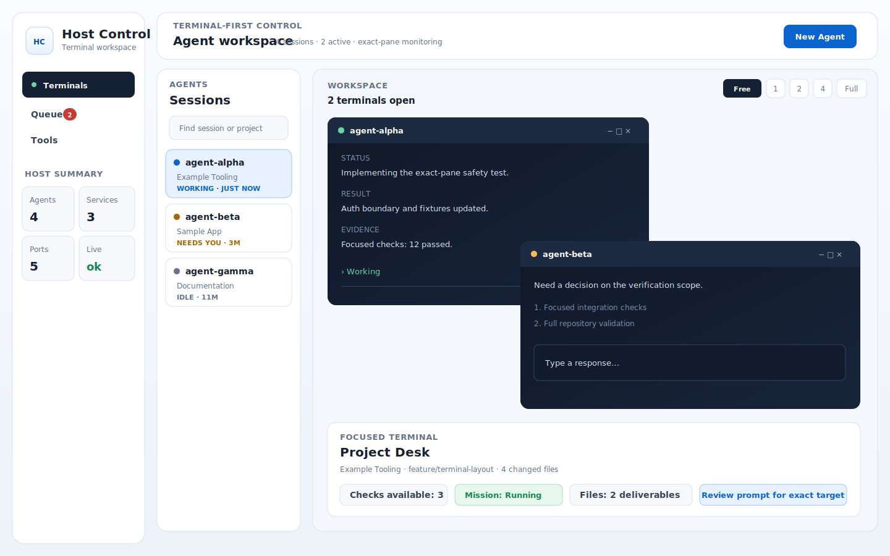
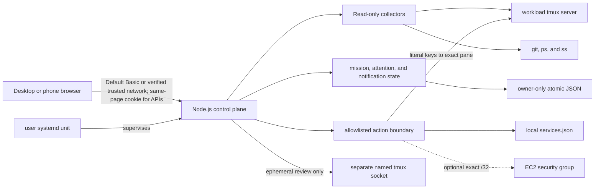

# Host Control

Safety-first, terminal-first operations for tmux-based Codex sessions and allowlisted developer services.


Host Control is a self-hosted cockpit for supervising several long-running Codex CLI sessions from a desktop or phone. It combines movable terminal windows, project context, a human-gated mission queue, and selected host controls without giving the browser an arbitrary shell.

The project is intentionally single-host and single-operator. It values exact targeting, visible approval, and safe failure over unattended automation.

> [!IMPORTANT]
> Loopback access stays frictionless. By default, any non-loopback bind additionally requires HTTP Basic authentication with username `host-control` and a long operator token. A deliberate `trusted-network` mode can suppress that prompt only when external ingress is already restricted to the operator's exact source. Host Control still has no roles or multi-user authorization, so network access should remain limited to one trusted operator.



<sub>Sanitized interface preview; all sessions, projects, and terminal text are synthetic.</sub>

## Why it exists

Working across multiple tmux agents usually means repeatedly attaching over SSH, remembering which pane owns which task, and manually correlating terminal output with project state. That becomes especially awkward on a phone.

Host Control keeps the terminal at the center while adding the context that raw tmux does not provide:

- **Terminal workspace** — open several live previews, drag or tile them on desktop, and use one fullscreen terminal at a time on a phone.
- **Project Desk** — inspect bounded Git state, project instructions, useful links, and generated PDFs for the focused terminal; keep browser-local notes and prompt drafts beside it.
- **Mission Queue** — record desired outcomes, dispatch only to an explicitly selected idle worker, surface exceptions, and require separate verification before Done.
- **Host tools** — inspect sessions, listeners, processes, and services; run only actions registered in a machine-local allowlist.

See [Features](docs/features.md) for the detailed behavior.

## Safety at a glance

- Normal prompt delivery is literal terminal text followed by one Enter. Interrupt, stop, and recovery actions remain separate controls.
- Every sensitive terminal action is revalidated against durable tmux identity: session creation time, pane coordinate, intrinsic pane ID, and pane PID.
- There is no arbitrary command endpoint. Service commands live in the ignored `services.json` registry and must be explicitly safe or visibly confirmed.
- Every operational `/api` request requires a control cookie issued by the same page. Non-loopback listeners require the operator's HTTP Basic credential before that cookie can be issued.
- Uncertain dispatch is never retried automatically. A mission cannot be marked Done without a human verification step and recorded evidence.
- The systemd control plane is outside the workload tmux server. Restart helpers verify health and compare the workload pane inventory before and after.
- Filesystem reads use allowlisted roots, real-path containment, output caps, and redaction. Project Desk exposes neither arbitrary paths nor a shell.

The full assumptions and failure behavior are in the [Safety model](docs/safety-model.md).

## Architecture



The browser is a vanilla HTML/CSS/JavaScript client. The server uses Node.js built-ins and small host command adapters, so the application has zero runtime npm dependencies. This keeps installation simple; it does not remove the need to secure the host commands and network boundary.

See [Architecture](docs/architecture.md) for component responsibilities, state ownership, request flow, and the exact-pane dispatch sequence.

## Quick start

### Prerequisites

- Linux with Node.js 20 or newer
- `tmux`, `git`, `curl`, `ps`, and `ss`
- Codex CLI installed and authenticated for agent launch, model, and prompt controls
- A modern browser

systemd is optional for foreground evaluation and recommended for a persistent installation. AWS CLI and instance permissions are needed only for the optional EC2 access controls.

### Run on loopback

After cloning the repository:

```bash
npm ci
cp services.example.json services.json
npm run verify:public
HOST=127.0.0.1 PORT=8787 npm start
```

`npm ci` verifies the committed lockfile; it installs no runtime packages in the current zero-runtime-dependency build. Edit the ignored `services.json` only if you want Host Control to manage selected local services; existing tmux sessions can still be discovered without it. Copy `host-config.example.json` to the ignored `host-config.json` only when you need extra workspace roots, labels, groups, aliases, or artifact folders.

On the same machine, open `http://127.0.0.1:8787`. From another machine, keep Host Control on loopback and create a tunnel:

```bash
ssh -N -L 8787:127.0.0.1:8787 user@your-host
```

Then open `http://127.0.0.1:8787` locally.

For a supervised installation, authenticated non-loopback access, migration, status checks, and restart behavior, read [Operations](docs/operations.md). Registry, host configuration, access-token, and environment settings are documented in [Configuration](docs/configuration.md).

## Validation

```bash
npm run check
npm run privacy:check
# or both:
npm run verify:public
```

`npm run check` runs JavaScript syntax validation plus isolated Node test suites. `npm run privacy:check` scans tracked files and Git history for blocked private paths, binary captures, credentials, personal paths, and non-documentation network identifiers. `npm run verify:public` runs both. CI installs from `package-lock.json` and runs the public verification on supported Node versions.

Test servers bind to loopback in temporary directories and replace tmux, AWS, metadata, and host-process commands with fixtures. Coverage emphasizes failure modes: non-loopback authentication, missing control cookies, stale pane identity, partial prompt rendering, uncertain Enter delivery, mission revision conflicts, restart isolation, path traversal, and access-rule cleanup.

## Repository map

| Path | Purpose |
| --- | --- |
| `server.js` | HTTP control plane, host collectors, mission state, and guarded actions |
| `process-runner.js` | Central process adapter and permanently forbidden tmux operations |
| `public/` | Dependency-free browser shell and UI state helpers |
| `services.example.json` | Sanitized template for the ignored local service registry |
| `host-config.example.json` | Sanitized schema for ignored host workspace and artifact configuration |
| `package-lock.json` | Reproducible zero-runtime-dependency npm install metadata |
| `ops/` | User-systemd unit template |
| `scripts/` | Installation, access-token, privacy, status, restart, and compatibility helpers |
| `test/` | Isolated integration, lifecycle, mission, terminal, and UI tests |
| `docs/` | Feature, configuration, safety, and operations references |
| `.github/workflows/` | Public verification across supported Node versions |

## Current limitations

- Host Control is designed for one trusted operator on one Linux host. It is not a multi-user control plane.
- Non-loopback HTTP Basic authentication uses one shared operator credential; it does not provide accounts, roles, or audit identities for multiple people.
- Agent behavior is Codex-first and depends on recognizable Codex CLI terminal states; it is not a provider-neutral agent protocol.
- Mission state is durable local JSON, not a distributed scheduler or database-backed queue.
- Terminal status inference is conservative and heuristic. Ambiguity is surfaced for human review rather than hidden.
- The optional EC2 access workflow is environment-specific and should remain disabled when its network and IAM assumptions do not apply.
- A public live demo would grant control of its host. Use sanitized recordings or a separately built fixture-only demo instead.

## Documentation

- [Features](docs/features.md)
- [Architecture](docs/architecture.md)
- [Configuration](docs/configuration.md)
- [Safety model](docs/safety-model.md)
- [Operations](docs/operations.md)
- [Security policy](SECURITY.md)
- [Contributing](CONTRIBUTING.md)

## License

Host Control is available under the [MIT License](LICENSE). The `private: true` field in `package.json` only prevents accidental publication to the npm registry; it does not change the source license.
