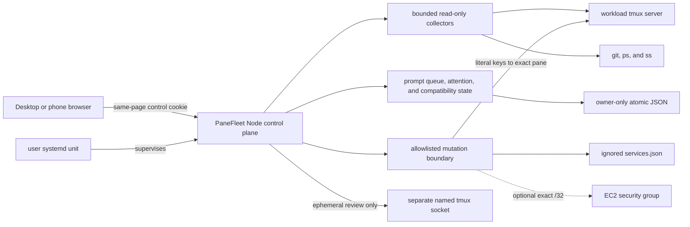

# PaneFleet

### A safety-first control room for tmux-based AI coding agents

Supervise long-running Codex sessions from desktop or phone, keep project context beside each terminal, line up prompts for the next green composer, and expose only explicitly allowlisted host controls.


<p align="center">
  
</p>

<p align="center"><sub>Actual browser render using synthetic sessions, projects, and terminal output. No live host data appears in this repository.</sub></p>

## Why PaneFleet exists

Running several coding agents in tmux works well until the operator has to remember which pane owns which task, which project has uncommitted work, which agent is waiting, and whether a pasted prompt was really submitted. The friction is worse from a phone.

PaneFleet keeps tmux as the durable runtime and adds the missing operator layer:

- movable, resizable, and tiled terminal previews;
- exact-pane targeting for terminal input;
- branch, changed-file, test, instruction, artifact, and note context for the focused project;
- a durable per-terminal prompt queue with optional UTC cron intake that releases only on stable green readiness;
- exception-focused attention and browser notifications; and
- narrowly allowlisted service, listener, process, and EC2 ingress tools.

It is deliberately not an autonomous agent framework. PaneFleet helps one human safely supervise the terminal agents they already run.

## What makes it different

| Concern | PaneFleet behavior |
| --- | --- |
| Terminal identity | Revalidates session creation time, pane coordinate, intrinsic tmux pane ID, and pane PID before sensitive input |
| Prompt delivery | Sends literal text plus one Enter, then observes acceptance; ambiguous delivery is never retried automatically |
| Queued prompts | Bind to one exact tmux pane, wait for two stable green samples, and release FIFO one prompt at a time |
| Recurring prompts | Parse five-field UTC cron in-process and add at most one normal queue item per schedule when due; never execute cron as shell |
| Uncertain delivery | Pauses that terminal's line for inspection and never retries or advances automatically |
| Host actions | Uses named API operations and an ignored local registry; there is no arbitrary shell-command endpoint |
| Filesystem access | Restricts reads to reviewed roots with real-path containment, output caps, and sensitive-value redaction |
| Restarts | Keeps the systemd control plane outside the workload tmux server and compares pane inventory around restart |

## Product tour

### Terminal workspace

Open several tmux-backed agents without replacing tmux itself. Desktop windows can float, tile into one/two/four-pane layouts, minimize, or stretch to full height. The Sessions and Details toggles independently reclaim space on a widescreen and remember their state in the browser; Focus canvas (or `Alt+0`) still provides a one-step distraction-free view. Open and docked live terminal views restore after a browser refresh only when their exact pane identities still match, so a recycled tmux name is never reopened as the old agent. Freeform desktop positions and sizes return within the current workspace bounds, and an intentionally paused browser capture stays paused on both desktop and phone. The browser title surfaces offline/polling state, decisions, queue depth, or active work while retaining the current section; installed browsers that support the Badging API also show the decision count. Terminal tools are separated into Read, Agent, and Recovery groups: a compact row on desktop and a labeled touch grid on phones. Recovery exposes confirmed Send Ctrl-C and Stop session actions without making the browser-view close button destructive. Text size and long-line wrapping persist across devices, and tapping the displayed percentage resets text to 100%. Read tools copy or search the current capture without terminal input; `Ctrl/⌘+F` opens Find for the active terminal, while Pause freezes one browser capture as its agent keeps running. Resume fetches the live pane again. Tap or press `?` for the complete keyboard shortcut guide. The session rail stays ordered by recent interaction and calls out agents that need a decision.

Terminal input remains intentionally plain: reviewed literal text followed by one Enter. Picker navigation, interrupt, stop, and recovery controls are visibly separate operations.

### Project Desk and prompt scratchpad

Focusing a terminal loads bounded project context beside it:

- current branch and changed files;
- available checks and their recorded state;
- nearest project instructions;
- reviewed links and downloadable PDF, Markdown, and HTML outputs;
- browser-local project notes; and
- persistent prompt drafts and reusable snippets.

A scratchpad draft cannot reach tmux until the operator reviews both the text and the exact target terminal.

### Green-light prompt queue

Choose an exact live terminal, add a plain prompt, and keep working elsewhere. Blue means the agent is working, orange means it needs input, and green means the Codex composer is visibly ready. PaneFleet requires two stable green observations before it durably claims and submits the first prompt for that terminal.

Before typing, PaneFleet arms exit preservation on that exact pane and revalidates its intrinsic identity. If the guard cannot be applied, no text is sent. If Codex exits after Enter, the pane remains available for inspection, becomes stopped instead of green, and receives no automatic retry.

The Queue tab is a full workspace with accurate completion statistics, current work, completed delivery history, and a live terminal board. Each exact-pane card separates active work from waiting backlog and shows the line head. Select one card for the normal single-agent flow or select up to twelve exact agents for one reviewed prompt. **Queue** atomically creates one independent FIFO item per selected terminal; if any identity is stale, none are created. **Send now** uses every pane's normal literal-text-plus-Enter path and reports each target separately because successful terminal input cannot be rolled back. Partial sends are never retried automatically, and recurring schedules remain single-terminal. Finished history—including legacy unconfirmed and canceled records—can be cleared with an explicit revision-checked confirmation without removing active work, queued prompts, or recurring schedules.

After a delivered prompt finishes, PaneFleet prefers a stable Codex final-response boundary ending in the `Worked for` footer and labels that snapshot **Verified final response**. Some Codex turns return to the composer without emitting that footer. If the exact submitted marker, a non-empty response block, a later composer, the Codex status bar, and stable green readiness all agree, PaneFleet stores the bounded response as **Returned to ready · no footer** and releases the next prompt without claiming the underlying project task is Done. A merely green-looking composer without that safe return boundary remains **Waiting for final response**. Snapshots preserve terminal formatting such as bullets and separators and are display-only: capture never sends terminal input.

Each terminal has its own FIFO line, monitored by the PaneFleet server even when the browser is closed. A successful submission advances only after either a stable footer boundary or a stable, safely bounded return to the exact composer. If stable green has neither boundary, PaneFleet moves the item to **Needs review: final response missing** after two minutes. After inspecting the terminal, the operator can explicitly **Release queue** or cancel the ticket; release records an operator decision, sends no input, and does not claim task completion. Any ambiguous rendering, Enter, acceptance, restart, timeout, or pane-identity result pauses the line for human inspection. PaneFleet never retries an uncertain attempt.

Accepted-ticket badges continue reflecting the exact terminal: **Blue · agent working**, **Green · verifying return**, or an input/error state. If a verbose or newer turn pushes the unique dispatch marker beyond PaneFleet's bounded terminal capture, the ticket becomes **Needs review: capture boundary expired** once that pane is stably ready instead of remaining pending indefinitely.

If a newer manual send or interrupt reaches the same exact pane before a queue ticket has a trustworthy finish boundary, PaneFleet immediately moves the older ticket to **Needs review: newer activity detected**. It does not label the newer work as belonging to the old ticket. A real item-specific footer still wins when it remains visible and stable.

Add an optional five-field UTC cron expression to make the prompt recurring. A due occurrence creates an ordinary queue item; it does not type into a busy terminal. If that schedule already has an item queued, dispatching, or awaiting review, the occurrence is coalesced instead of building a backlog. PaneFleet skips a missing or replaced exact pane rather than targeting a same-name replacement, and a restart advances a missed schedule once without replaying every missed interval. Recurring cards show the next run and last outcome and can be paused, resumed, or deleted without changing items already in the queue.

### Phone-first terminal access

On a phone, sessions stay in a bounded vertical list so many agents can be scanned without a long horizontal carousel. Opening one turns it into a fullscreen control surface with large model, command, input, and navigation controls. When several terminals are open, a named chooser jumps directly to any terminal—including docked views—while previous and next remain available for fast sequential checks. Draft focus is preserved while dashboard snapshots refresh. Ultrawide workspaces expose the same direct chooser beside the terminal layout controls.

<p align="center">
  
</p>

<p align="center"><sub>Synthetic mobile capture at 390 × 844.</sub></p>

### Host and access tools

PaneFleet can show tmux sessions, listeners, processes, registered services, recent audit events, and selected EC2 inbound rules. Mutations stay behind allowlisted server operations and explicit confirmation.

The optional IP workflow can authorize one globally routable IPv4 `/32` and preview cleanup of stale PaneFleet-owned rules. It preserves active SSH peers and unmanaged, IPv6, source-group, prefix-list, broad, unrelated-port, and otherwise out-of-scope rules.

## Safety model

PaneFleet is privileged, single-operator software. It assumes the host account, tmux server, Codex configuration, and service registry belong to one trusted operator.

Network access has two supported shapes:

1. **Recommended:** bind to loopback and connect through an SSH tunnel or private overlay.
2. **Explicit non-loopback:** use the built-in Basic challenge by default, or suppress it only in `trusted-network` mode after an external firewall or cloud security group has independently been verified to allow the dashboard port solely from the operator's exact IPv4 `/32`.

Every operational `/api` request still requires an HttpOnly, SameSite=Strict control cookie issued by the same page. POST requests additionally require JSON and same-origin validation. `/healthz` is the only intentionally minimal public route.

> [!WARNING]
> Do not expose PaneFleet broadly. It can observe terminal and host state and can send input to explicitly selected panes.

Read the full [Safety model](docs/safety-model.md) before using non-loopback access or enabling host mutations.

## Architecture



The browser is vanilla HTML, CSS, and JavaScript. The server uses Node.js built-ins plus small host-command adapters and has zero runtime npm dependencies.

See [Architecture](docs/architecture.md) for state ownership, request flow, and the exact-pane dispatch sequence.

## Quick start

### Requirements

- Linux and Node.js 20 or newer
- `tmux`, `git`, `curl`, `ps`, and `ss`
- Codex CLI installed and authenticated for agent launch and prompt controls
- a modern browser

AWS CLI and instance permissions are needed only for the optional EC2 access workflow. systemd is optional for foreground evaluation and recommended for persistent operation.

### Run safely on loopback

```bash
git clone https://github.com/jmac4909/PaneFleet.git panefleet
cd panefleet
npm ci
cp services.example.json services.json
npm run verify:public
HOST=127.0.0.1 PORT=8787 npm start
```

Open `http://127.0.0.1:8787` on the host. From another machine, keep PaneFleet on loopback and create a tunnel:

```bash
ssh -N -L 8787:127.0.0.1:8787 user@your-host
```

Then open `http://127.0.0.1:8787` locally.

The ignored `services.json` file is optional and controls only reviewed service actions. Existing tmux sessions remain visible without it. Copy `host-config.example.json` to the ignored `host-config.json` when you need additional workspace roots, display aliases, groups, links, or artifact directories.

For systemd installation, authenticated non-loopback access, trusted-network mode, migration, backups, and restart behavior, read [Operations](docs/operations.md).

## Validation

```bash
npm run check
npm run test:coverage
npm run privacy:check

# Runs both:
npm run verify:public
```

The integration suite runs the real `server.js` entrypoint with a test-only temporary runtime root. It replaces tmux, AWS, instance metadata, Git, and host-process commands with fixtures, so tests exercise production routing and orchestration without touching live sessions or host controls. It emphasizes failure behavior: stale pane identity, incomplete rendering, uncertain Enter delivery, stable-green queue gating, restart reconciliation, path traversal, authentication boundaries, and access-rule cleanup.

`npm run test:coverage` measures the server, centralized process runner, and executable UI-state helpers, and enforces the checked-in coverage floor. `npm run check` includes that gate.

The privacy checker scans modified tracked files, untracked non-ignored files, and every stored Git commit, tag, and blob—including unreachable objects retained by reflogs. Ignored runtime data remains local and outside the publication candidate set. The checker rejects machine-local configuration, credentials, personal paths, non-documentation network identifiers, and unreviewed binary captures.

## Reproducing the screenshots

The committed images are generated from [docs/readme-demo.html](docs/readme-demo.html), which contains only synthetic data and uses the real application stylesheet.

```bash
CHROME_BIN=/path/to/chrome npm run screenshots:readme
npm run privacy:check
```

Only the two reviewed README capture paths are permitted by the privacy checker; arbitrary screenshots remain blocked.

## Repository map

| Path | Purpose |
| --- | --- |
| `server.js` | HTTP control plane, collectors, coordination state, and guarded actions |
| `process-runner.js` | Central process adapter and permanently forbidden tmux operations |
| `public/` | Dependency-free terminal-first browser interface |
| `services.example.json` | Sanitized template for the ignored local service registry |
| `host-config.example.json` | Sanitized template for workspace and artifact configuration |
| `ops/` | User-systemd unit template |
| `scripts/` | Installation, restart, screenshot, access-token, and privacy helpers |
| `test/` | Isolated integration, lifecycle, prompt-queue, terminal, and UI tests |
| `docs/` | Features, architecture, configuration, safety, and operations references |

## Current limits

- PaneFleet is for one trusted operator on one Linux host, not multiple users or distributed workers.
- Agent-state inference is Codex-first and intentionally conservative.
- Terminal windows show bounded tmux captures; PaneFleet is not a full browser PTY emulator.
- Prompt queue and UTC cron schedule state is local durable JSON, not a distributed or database-backed scheduler.
- The EC2 ingress workflow is optional and environment-specific.
- A public live demo would grant control of its host, so this repository uses reproducible synthetic captures instead.

## Documentation

- [Features](docs/features.md)
- [Architecture](docs/architecture.md)
- [Configuration](docs/configuration.md)
- [Safety model](docs/safety-model.md)
- [Operations](docs/operations.md)
- [Security policy](SECURITY.md)
- [Contributing](CONTRIBUTING.md)

## License

PaneFleet is available under the [MIT License](LICENSE). The `private: true` field in `package.json` prevents accidental npm publication; it does not change the source license.
