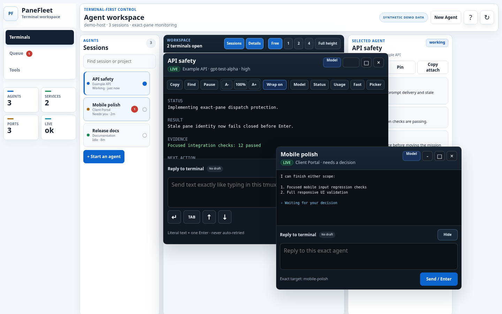
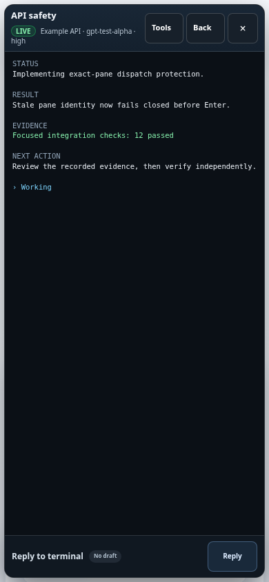
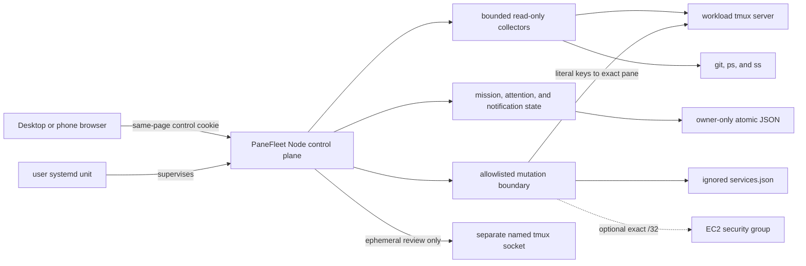

# PaneFleet

### A safety-first control room for tmux-based AI coding agents

Supervise long-running Codex sessions from desktop or phone, keep project context beside each terminal, queue work behind human gates, and expose only explicitly allowlisted host controls.


<p align="center">
  
</p>

<p align="center"><sub>Actual browser render using synthetic sessions, projects, and terminal output. No live host data appears in this repository.</sub></p>

## Why PaneFleet exists

Running several coding agents in tmux works well until the operator has to remember which pane owns which task, which project has uncommitted work, which agent is waiting, and whether a pasted prompt was really submitted. The friction is worse from a phone.

PaneFleet keeps tmux as the durable runtime and adds the missing operator layer:

- movable, resizable, and tiled terminal previews;
- exact-pane targeting for terminal input;
- branch, changed-file, test, instruction, artifact, and note context for the focused project;
- a persistent mission queue with explicit dispatch and verification gates;
- exception-focused attention and browser notifications; and
- narrowly allowlisted service, listener, process, and EC2 ingress tools.

It is deliberately not an autonomous agent framework. PaneFleet helps one human safely supervise the terminal agents they already run.

## What makes it different

| Concern | PaneFleet behavior |
| --- | --- |
| Terminal identity | Revalidates session creation time, pane coordinate, intrinsic tmux pane ID, and pane PID before sensitive input |
| Prompt delivery | Sends literal text plus one Enter, then observes acceptance; ambiguous delivery is never retried automatically |
| Queued work | Claims one existing idle worker and one workspace before input; restart reconciliation never resends a prompt |
| Completion | A stable agent report can move work only to **Verifying**; only the operator can mark it **Done** |
| Host actions | Uses named API operations and an ignored local registry; there is no arbitrary shell-command endpoint |
| Filesystem access | Restricts reads to reviewed roots with real-path containment, output caps, and sensitive-value redaction |
| Restarts | Keeps the systemd control plane outside the workload tmux server and compares pane inventory around restart |

## Product tour

### Terminal workspace

Open several tmux-backed agents without replacing tmux itself. Desktop windows can float, tile into one/two/four-pane layouts, minimize, or stretch to full height. The session rail stays ordered by recent interaction and calls out agents that need a decision.

Terminal input remains intentionally plain: reviewed literal text followed by one Enter. Picker navigation, interrupt, stop, and recovery controls are visibly separate operations.

### Project Desk and prompt scratchpad

Focusing a terminal loads bounded project context beside it:

- current branch and changed files;
- available checks and their recorded state;
- nearest project instructions;
- reviewed links and downloadable PDF artifacts;
- browser-local project notes; and
- persistent prompt drafts and reusable snippets.

A scratchpad draft cannot reach tmux until the operator reviews both the text and the exact target terminal.

### Human-gated mission queue

Missions move through **Backlog**, **Ready**, **Running**, **Needs You**, **Verifying**, and **Done**. Dispatch is durable before terminal input. The Mission Supervisor uses stable multi-sample terminal signals and exact pane identity to surface waiting, missing, stale, failed, or verification-ready work.

The supervisor cannot press Enter, resend input, stop a session, run a service action, or mark work Done.

### Phone-first terminal access

On a phone, one terminal becomes a fullscreen control surface with large model, command, input, and navigation controls. Draft focus is preserved while dashboard snapshots refresh.

<p align="center">
  
</p>

<p align="center"><sub>Synthetic mobile capture at 390 × 844.</sub></p>

### Host and access tools

PaneFleet can show tmux sessions, listeners, processes, registered services, recent audit events, and selected EC2 inbound rules. Mutations stay behind allowlisted server operations and explicit confirmation.

The optional IP workflow can authorize one globally routable IPv4 `/32` and preview cleanup of stale PaneFleet-owned rules. It preserves active SSH peers and unmanaged, IPv6, source-group, prefix-list, broad, unrelated-port, and otherwise out-of-scope rules.

## Safety model

PaneFleet is privileged, single-operator software. It assumes the host account, tmux server, Codex configuration, and service registry belong to one trusted operator.

Network access has two supported shapes:

1. **Recommended:** bind to loopback and connect through an SSH tunnel or private overlay.
2. **Explicit non-loopback:** use the built-in Basic challenge by default, or suppress it only in `trusted-network` mode after an external firewall or cloud security group has independently been verified to allow the dashboard port solely from the operator's exact IPv4 `/32`.

Every operational `/api` request still requires an HttpOnly, SameSite=Strict control cookie issued by the same page. POST requests additionally require JSON and same-origin validation. `/healthz` is the only intentionally minimal public route.

> [!WARNING]
> Do not expose PaneFleet broadly. It can observe terminal and host state and can send input to explicitly selected panes.

Read the full [Safety model](docs/safety-model.md) before using non-loopback access or enabling host mutations.

## Architecture



The browser is vanilla HTML, CSS, and JavaScript. The server uses Node.js built-ins plus small host-command adapters and has zero runtime npm dependencies.

See [Architecture](docs/architecture.md) for state ownership, request flow, and the exact-pane dispatch sequence.

## Quick start

### Requirements

- Linux and Node.js 20 or newer
- `tmux`, `git`, `curl`, `ps`, and `ss`
- Codex CLI installed and authenticated for agent launch and prompt controls
- a modern browser

AWS CLI and instance permissions are needed only for the optional EC2 access workflow. systemd is optional for foreground evaluation and recommended for persistent operation.

### Run safely on loopback

```bash
git clone https://github.com/jmac4909/PaneFleet.git panefleet
cd panefleet
npm ci
cp services.example.json services.json
npm run verify:public
HOST=127.0.0.1 PORT=8787 npm start
```

Open `http://127.0.0.1:8787` on the host. From another machine, keep PaneFleet on loopback and create a tunnel:

```bash
ssh -N -L 8787:127.0.0.1:8787 user@your-host
```

Then open `http://127.0.0.1:8787` locally.

The ignored `services.json` file is optional and controls only reviewed service actions. Existing tmux sessions remain visible without it. Copy `host-config.example.json` to the ignored `host-config.json` when you need additional workspace roots, display aliases, groups, links, or artifact directories.

For systemd installation, authenticated non-loopback access, trusted-network mode, migration, backups, and restart behavior, read [Operations](docs/operations.md).

## Validation

```bash
npm run check
npm run privacy:check

# Runs both:
npm run verify:public
```

The test suite runs isolated servers in temporary directories and replaces tmux, AWS, instance metadata, Git, and host-process commands with fixtures. It emphasizes failure behavior: stale pane identity, incomplete rendering, uncertain Enter delivery, mission revision conflicts, restart isolation, path traversal, authentication boundaries, and access-rule cleanup.

The privacy checker scans tracked files plus every stored Git commit, tag, and blob—including unreachable objects retained by reflogs. It rejects machine-local configuration, credentials, personal paths, non-documentation network identifiers, and unreviewed binary captures.

## Reproducing the screenshots

The committed images are generated from [docs/readme-demo.html](docs/readme-demo.html), which contains only synthetic data and uses the real application stylesheet.

```bash
CHROME_BIN=/path/to/chrome npm run screenshots:readme
npm run privacy:check
```

Only the two reviewed README capture paths are permitted by the privacy checker; arbitrary screenshots remain blocked.

## Repository map

| Path | Purpose |
| --- | --- |
| `server.js` | HTTP control plane, collectors, coordination state, and guarded actions |
| `process-runner.js` | Central process adapter and permanently forbidden tmux operations |
| `public/` | Dependency-free terminal-first browser interface |
| `services.example.json` | Sanitized template for the ignored local service registry |
| `host-config.example.json` | Sanitized template for workspace and artifact configuration |
| `ops/` | User-systemd unit template |
| `scripts/` | Installation, restart, screenshot, access-token, and privacy helpers |
| `test/` | Isolated integration, lifecycle, mission, terminal, and UI tests |
| `docs/` | Features, architecture, configuration, safety, and operations references |

## Current limits

- PaneFleet is for one trusted operator on one Linux host, not multiple users or distributed workers.
- Agent-state inference is Codex-first and intentionally conservative.
- Terminal windows show bounded tmux captures; PaneFleet is not a full browser PTY emulator.
- Mission state is local durable JSON, not a database-backed scheduler.
- The EC2 ingress workflow is optional and environment-specific.
- A public live demo would grant control of its host, so this repository uses reproducible synthetic captures instead.

## Documentation

- [Features](docs/features.md)
- [Architecture](docs/architecture.md)
- [Configuration](docs/configuration.md)
- [Safety model](docs/safety-model.md)
- [Operations](docs/operations.md)
- [Security policy](SECURITY.md)
- [Contributing](CONTRIBUTING.md)

## License

PaneFleet is available under the [MIT License](LICENSE). The `private: true` field in `package.json` prevents accidental npm publication; it does not change the source license.
