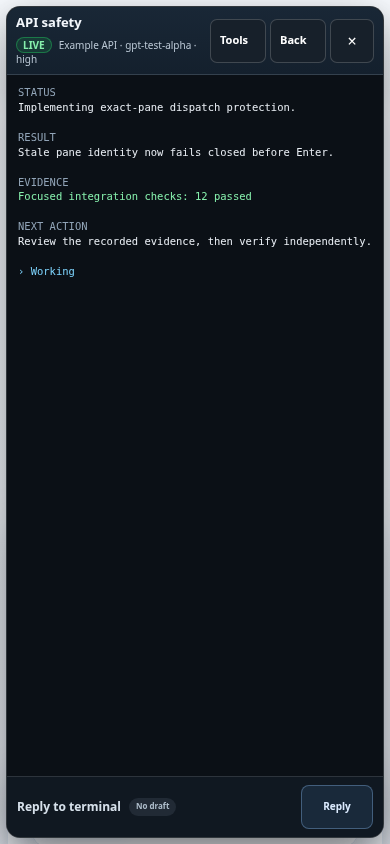
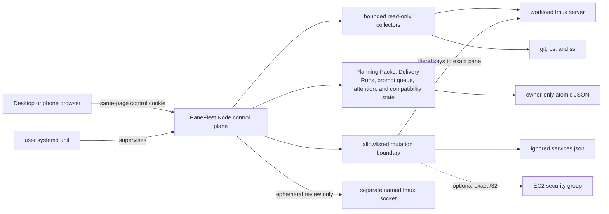

# PaneFleet

### A dashboard for tmux-based coding agents

Supervise terminal-based coding agents from desktop or phone. Keep project context beside each session, review queued work, and send input to the exact pane you intended.


<p align="center">
  
</p>

<p align="center"><sub>Actual browser render using synthetic sessions, projects, and terminal output. No live host data appears in this repository.</sub></p>

## Why PaneFleet exists

Running several coding agents in tmux works well until the operator has to remember which pane owns which task, which branch a project is on, which agent is waiting, and whether a pasted prompt was really submitted. The friction is worse from a phone.

PaneFleet keeps tmux as the durable runtime and adds the missing operator layer:

- movable, resizable, and tiled terminal previews;
- exact-pane targeting for terminal input;
- branch, HEAD, test, instruction, artifact, and note context for the focused project;
- an Agent Commons for threaded updates, questions, scoped waits, soft work claims, governed help requests, decisions, and reversible lessons;
- durable SDLC Planning Packs plus governed local Delivery Runs that keep PO, BA, DEV, and QA concerns reviewable across execution;
- a durable per-terminal prompt queue with optional UTC cron intake that releases only on stable green readiness;
- exception-focused attention and browser notifications; and
- narrowly allowlisted service, listener, process, and EC2 ingress tools.

It is deliberately not an autonomous agent framework. PaneFleet helps one human safely supervise the terminal agents they already run.

## Design and validation

| Start here | What to look for |
| --- | --- |
| [Architecture](docs/architecture.md) | A small Node control plane, durable stores, bounded observations, and a dependency-light browser client |
| [Safety model](docs/safety-model.md) | Exact process identity, separate approval and execution, and explicit handling of uncertain input |
| [Lifecycle safety tests](test/lifecycle-safety.test.js) and [validation commands](CONTRIBUTING.md#code-and-tests) | Failure-path coverage using synthetic sessions and fake host tools, not a live operator's account |
| [Quick start](#quick-start) | Run a separate local installation |

Ambiguous delivery stays visible for review instead of being retried automatically. PaneFleet is privileged single-operator software, not a multi-tenant isolation boundary. Screenshots use synthetic data; automated tests do not replace real-device checks.

## What makes it different

| Concern | PaneFleet behavior |
| --- | --- |
| Terminal identity | Revalidates session creation time, pane coordinate, intrinsic tmux pane ID, and pane PID before sensitive input |
| Prompt delivery | Sends literal text plus one Enter, then observes acceptance; ambiguous delivery is never retried automatically |
| Queued prompts | Bind to one exact tmux pane, wait for two stable green samples, and release FIFO one prompt at a time |
| Recurring prompts | Parse five-field UTC cron in-process and add at most one normal queue item per schedule when due, or queue one occurrence manually with **Queue now**; never execute cron as shell |
| SDLC delivery | Can gather bounded PO, BA, QA, and DEV planning reports in read-only workers, applies only a reviewed candidate revision, then uses separate approval and local-run gates for one digest-bound Mission at a time |
| Agent coordination | Keeps threaded Commons messages as untrusted data; attention never types or interrupts, and a Help request prefers an idle existing agent before offering one operator-approved helper |
| Uncertain delivery | Pauses that terminal's line for inspection and never retries or advances automatically |
| Host actions | Uses named API operations and an ignored local registry; there is no arbitrary shell-command endpoint |
| Filesystem access | Restricts reads to reviewed roots with real-path containment, output caps, and sensitive-value redaction |
| Restarts | Keeps the systemd control plane outside the workload tmux server, isolates each Codex process in a bounded scope, and recovers registered crashes only by an exact root-interactive rollout without replaying prompts |

## Product tour

### Terminal workspace

Open, tile, minimize, resize, and restore several tmux-backed terminals without replacing tmux itself. The session rail shows each live Codex agent and each registered or auto-discovered non-Codex tmux workload once; multi-window workloads are grouped into one read-only entry. Restored views must still match their original exact pane identity.

Terminal input remains intentionally plain: reviewed literal text followed by one Enter. Read tools never send input, while picker navigation, interrupt, stop, and recovery remain visibly separate operations. If Codex exits to its still-live shell after an update, the exact terminal presents **Resume saved chat** only when PaneFleet has registered its exact saved root-interactive rollout. PaneFleet names and confirms this as a conversation resume because it cannot select a topic or start a new chat; unregistered, legacy, parented, and sub-agent panes fail closed with no input. See [Features](docs/features.md#terminal-workspace) for the complete desktop, phone, and keyboard behavior.

### Project Desk and prompt scratchpad

Focusing a terminal loads bounded project context beside it:

- current branch and abbreviated HEAD; Project Desk deliberately does not collect working-tree status;
- available checks and their recorded state;
- nearest project instructions;
- reviewed links and downloadable PDF, Markdown, and HTML outputs;
- browser-local project notes; and
- persistent prompt drafts and reusable snippets.

A scratchpad draft cannot reach tmux until the operator reviews both the text and the exact target terminal.

### SDLC Planning Packs

Nontrivial work can be captured as a durable Planning Pack before it becomes terminal work. The operator may author the Product Owner outcome, Business Analyst requirements, Developer steps and scope, and QA acceptance strategy directly. For a narrow standard-depth, local-reversible `change` or `build`, PaneFleet can instead start a separate durable Planning Run: PO completes first, BA receives the PO result, and QA and DEV then review the same PO-plus-BA input independently. Each report is schema-bound to the exact Plan revision, worker attempt, and read-only Codex rollout.

The dedicated **SDLC** workspace sits beside Terminals and Queue as an **AAP Workshop**. The Agent Action Plan stays in the middle while Product Owner, Business Analyst, Quality Analyst, and Developer roles challenge it in a structured round. There is no intake form: start with one rough message about an idea, problem, existing project, uncertainty, or half-formed plan. Project context is optional, and a real Git baseline is required only before approval or coding. **Send to workshop** is the one workshop action: it creates or updates the unapproved AAP and starts the resource-gated PO, BA, QA, and DEV round; it never starts coding. Between rounds, the message is optional, so the same button can run the current AAP unchanged. While a round is active, the button is disabled and preserves the next draft without changing the frozen role inputs. Each round returns one proposed AAP revision for the operator to use, challenge, or leave unchanged before a separate approval and coding handoff. Raw Planning Pack JSON is not exposed in the workshop UI; hashes, worker identity, and recovery data remain under technical disclosures.

Planning workers run in fresh PaneFleet-owned internal sessions from a private, minimal Codex home and a neutral non-project directory. Installation pins the canonical native Codex 0.147.0 executable, version, and SHA-256 into the private user unit; a missing, changed, non-native, or mismatched executable disables Planning rather than falling back to the ordinary launcher. A deny-by-default permission profile permits only Codex's minimal runtime reads, denies project and other host paths, disables command network access, and uses approval policy `never`; hooks, shell/exec, browser, MCP, plugin, memory, subagent, and other callable tool surfaces are disabled. The trusted Codex platform context remains, but no project `AGENTS.md`, user Codex configuration, or generic PaneFleet terminal surface is part of the role boundary.

Before each tmux launch, PaneFleet durably reserves the deterministic transient scope and a bounded spawn lease. A scope that cannot establish process and rollout identity by its deadline is never adopted late. The UI exposes a separate, explicit **Terminate stuck planning worker** action only after the server has identified the durably bound exact transient Planning scope; that one-shot action stops only that scope and is never a Continue or automatic recovery. Each scope also has a 30-minute runtime limit and a 30-second systemd stop timeout. Planning output cannot edit or approve the Plan. PaneFleet deterministically compiles only a candidate replacement for the four role artifacts and unresolved questions, shows the exact diff and digest, and requires the operator to apply that candidate explicitly. Apply creates an unapproved Plan revision and starts no execution. A resource wait, crash, uncertain input, replaced process, invalid report, or restart pauses durably; startup never types or spawns on its own, and terminal input is never retried automatically.

Whether authored manually or through a Planning Run, PaneFleet validates the bounded schema and links every requirement to implementation and acceptance. Each reviewed definition has a canonical digest, and any material edit invalidates its earlier approval.

Approval and execution are deliberately separate. **Approve exact digest** records review of one current definition and sends no terminal input. A later confirmed **Create local execution run** is available only for a ready, `local_reversible` `change` or `build` plan whose sole authority is `workspaceWrite`. That action rechecks the approved digest and workspace baseline, creates a separate digest-bound Delivery Run, and ensures one ready Mission for the first DEV step; it still sends no terminal input.

The supported execution workspace is an isolated, normal Git checkout with a canonical, current-user-owned, non-group/world-writable in-repository `.git` directory and no ignored paths. Baseline v2 fingerprints the raw bytes of every index-tracked and untracked file without invoking Git working-tree porcelain, diffs, object filters, or repository hooks. It rejects sparse state, submodules/gitlinks, unmerged index entries, `assume-unchanged` or `skip-worktree` concealment, untrusted Git directories, and unsafe hardlink, special-file, or symlink cases. Ordinary modified or untracked files are fingerprinted rather than categorically rejected, but an isolated starting workspace keeps their ownership and later scope comparison unambiguous.

The operator dispatches from Mission Queue to an exact worker launched with PaneFleet's Local Delivery profile: workspace-write sandbox, approval policy `never`, and outbound sandbox network disabled. Dispatch binds both the tmux identity and the Codex execution identity (PID, rollout ID, rollout source, and command digest), records the rollout file's byte offset immediately before input, and accepts the required Delivery Result only from that same rollout after the dispatch marker and offset. A contradictory authority observation or replacement fails closed.

Delivery Runs serialize DEV steps. Before each handoff PaneFleet checks the expected baseline and compiles a bounded scope envelope. After a Mission returns for verification, **Capture local implementation** records changed-path and worker-report summaries only when the workspace stayed within the approved path set. The operator then supplies Passed, Failed, or Not run plus an observation for every linked acceptance criterion and every required check on that DEV step, followed by an overall note. PaneFleet persists bounded operator-authored attestations; it does not execute those checks or retain their command output.

PaneFleet labels the result `planned`, `implemented_locally`, or `verified_locally`; this is a local lifecycle record, not proof of a commit, push, release, deployment, or live result. An explicit operator-confirmed abort can terminalize an unverified Run and return its Plan to `planning` only when no linked worker is dispatching, running, waiting for input, or uncertain. It cancels only safe ready or verifying linked Missions and sends no terminal input or process signal. Full Plan, Planning Run, and Delivery Run details load on demand instead of being copied into every dashboard snapshot. See the [SDLC delivery standard](docs/sdlc-delivery-standard.md) for the complete lifecycle and future phases.

### Agent Commons

The **Commons** navigation workspace gives the operator and live agents a durable shared room without turning conversation into a command bus. Threads can be global or project-scoped, addressed to everyone or selected sessions, and classified as updates, questions, observations, decisions, waits, soft work claims, help requests, or candidate lessons. Claims retain evidence, lessons advance through reversible states, older lessons can be explicitly retired, and independent-first decisions withhold peer replies in the normal agent inbox until that agent contributes.

Attention is graduated: **Board** is ambient, **Ping** asks for awareness, **Nudge** asks for steering at the next safe checkpoint, and **Stop request** flags urgent operator review. A Stop request is appropriate when continuing risks harm, cost, data loss, or work on the wrong target. It still never sends `Ctrl-C`; the operator opens the exact terminal and decides whether a separate manual interrupt is warranted. Agent posts enter through an owner-only spool tied to a claimed currently live pane identity, but all Commons content and attribution remain untrusted same-user collaboration data—not authentication, execution authority, or proof that a claim is true.

A project-scoped **Help request** first recommends one compatible idle agent already in that workspace. That recommendation only opens the terminal for review; it does not assign or send work. If none is available, PaneFleet may prepare one deterministic helper draft, but only the operator can press **Approve & Start One Helper**. The server rechecks the open request, workspace, name, isolated control plane, disk, memory, swap, and pressure before tmux creation. A helper cannot recursively qualify another helper, auto-recovery is disabled, and accepting its initial prompt leaves the request open until the outcome is reviewed. Separate requests can each receive one helper; no request creates a fan-out chain.

### Green-light prompt queue

Choose an exact live terminal, add a plain prompt, and keep working elsewhere. Blue means the agent is working, orange means it needs input, and green means the Codex composer is visibly ready. PaneFleet requires two stable green observations before it durably claims and submits the first prompt for that terminal.

Before typing, PaneFleet arms exit preservation on that exact pane and revalidates its intrinsic identity. If the guard cannot be applied, no text is sent. If Codex exits after Enter, the pane remains available for inspection, becomes stopped instead of green, and receives no automatic retry.

The Queue workspace shows each exact-pane FIFO line, current work, recurring schedules, and bounded delivery history. One reviewed prompt can be queued atomically for up to twelve agents; a stale target rejects the whole queue operation, while immediate multi-send reports each irreversible result separately. A user can leave only before dispatch claims an item.

PaneFleet monitors queues and due schedules on the server even when every browser is closed. It advances a delivered item only from exact-pane final evidence: a stable `Worked for` footer or a safely bounded footerless return to a later composer. Uncertain rendering, submission, identity, completion, or newer activity pauses for explicit review and is never retried automatically. A pre-Enter item can remain blocked in **Wait again — no resend** while PaneFleet watches for the operator to submit that already-visible prompt manually.

The same workspace keeps proposed ideas non-runnable until approval creates a normal exact-pane ticket. Optional five-field UTC schedules add ordinary queue items, coalesce while one occurrence remains open, and skip replaced targets without catch-up bursts.

See [Features](docs/features.md#green-light-prompt-queue) for queue states and recovery actions, and [Safety model](docs/safety-model.md#prompt-queue-invariants) for the enforced invariants.

### Phone-first terminal access

On a phone, the session list remains bounded and one terminal becomes a fullscreen control surface. A named chooser, previous/next navigation, durable drafts, and passively replayed session and per-ticket usage—kept separate from account-wide limits—make multi-agent operation practical without sending status commands.

<p align="center">
  
</p>

<p align="center"><sub>Synthetic mobile capture at 390 × 844.</sub></p>

### Host and access tools

PaneFleet can show tmux sessions, listeners, processes, registered services, recent audit events, and selected EC2 inbound rules. Mutations stay behind allowlisted server operations and explicit confirmation.

The Security view keeps a bounded, owner-only connection and SSH journal and flags new peers, unexpected public listeners, authentication failures, and uncommon outbound ports. Monitoring is read-only and retains parsed metadata rather than raw journal lines.

The optional IP workflow can authorize one globally routable IPv4 `/32` and preview cleanup of stale PaneFleet-owned rules. It preserves active SSH peers and unmanaged, IPv6, source-group, prefix-list, broad, unrelated-port, and otherwise out-of-scope rules.

## Safety model

PaneFleet is privileged, single-operator software. It assumes the host account, tmux server, Codex configuration, and service registry belong to one trusted operator.

Planning also trusts the host operator and every other process running under PaneFleet's Unix UID. Owner-only stores and private runtime directories, the installer pin, runtime SHA-256 checks, and pre-input `/proc/<pid>/exe` attestation catch drift and accidental upgrades; they do not prevent a malicious same-UID process from racing or replacing binaries. Runtime does not probe Codex with `--version` or `mcp list`: version and file SHA are verified at installation, then the server hashes the configured file and attests the running image before role input. Root-owned immutable installation or a held-file-descriptor launch remains future hardening.

Network access has three supported shapes:

1. **Recommended:** bind to loopback and connect through an SSH tunnel or private overlay.
2. **Private HTTPS on phone or desktop:** keep PaneFleet on loopback behind the checked-in Caddy edge, use `device-session` mode for a normal sign-in form and revocable 30-day device cookie, and retain independently verified exact-source ingress.
3. **Explicit non-loopback:** use the built-in Basic challenge by default, or suppress it only in `trusted-network` mode after an external firewall or cloud security group has independently been verified to allow the dashboard port solely from the operator's exact IPv4 `/32`.

Every operational `/api` request still requires an HttpOnly, SameSite=Strict control cookie issued by the same page. POST requests additionally require JSON and same-origin validation. `/healthz` is the only intentionally minimal public route.

> [!WARNING]
> Do not expose PaneFleet broadly. It can observe terminal and host state and can send input to explicitly selected panes.

Read the full [Safety model](docs/safety-model.md) before using non-loopback access or enabling host mutations.

## Architecture


```mermaid
flowchart LR
    Browser[Desktop or phone browser] -->|same-page control cookie| Control[PaneFleet Node control plane]
    Systemd[user systemd unit] -->|supervises| Control

    Control --> Collect[bounded read-only collectors]
    Collect --> Tmux[workload tmux server]
    Collect --> Host[git, ps, and ss]

    Control --> Domain[Planning Packs, Delivery Runs, prompt queue, attention, and compatibility state]
    Domain --> Data[owner-only atomic JSON]

    Control --> Guard[allowlisted mutation boundary]
    Guard -->|literal keys to exact pane| Tmux
    Guard --> Registry[ignored services.json]
    Guard -. optional exact /32 .-> Cloud[EC2 security group]

    Control -->|ephemeral review only| Review[separate named tmux socket]
```

The browser is vanilla HTML, CSS, and JavaScript. The server uses Node.js built-ins plus small host-command adapters; its only runtime npm dependency is `bcryptjs` for device sign-in password verification.

Connected browsers share one server-owned SSE broadcast cycle. PaneFleet sends a complete sequenced snapshot on connection, then fans out the same top-level patch to every current client. A sequence gap reconnects for a complete snapshot, and a patch that would be larger falls back to the complete form. This reduces recurring transfer without weakening the exact-state revalidation performed by mutations.

See [Architecture](docs/architecture.md) for state ownership, request flow, and the exact-pane dispatch sequence.

## Quick start

### Requirements

- Linux and Node.js `>=22.23.0 <23` (the development version is pinned in `.node-version`)
- `tmux`, `git`, `curl`, `ps`, and `ss`
- Codex CLI installed and authenticated for agent launch and prompt controls; the systemd installer additionally requires the official native Codex 0.147.0 Planning executable unless Planning is explicitly disabled
- a modern browser

AWS CLI and instance permissions are needed only for the optional EC2 access workflow. systemd is optional for foreground evaluation and recommended for persistent operation.

### Run safely on loopback

```bash
git clone https://github.com/OWNER/PaneFleet.git panefleet
cd panefleet
npm ci
cp services.example.json services.json
npm run verify:public
HOST=127.0.0.1 PORT=8787 npm start
```

Open `http://127.0.0.1:8787` on the host. From another machine, keep PaneFleet on loopback and create a tunnel:

```bash
ssh -N -L 8787:127.0.0.1:8787 user@your-host
```

Then open `http://127.0.0.1:8787` locally.

The ignored `services.json` file is optional and controls only reviewed service actions. Existing tmux sessions remain visible without it. Copy `host-config.example.json` to the ignored `host-config.json` when you need additional workspace roots, display aliases, groups, links, or artifact directories.

For systemd installation, authenticated non-loopback access, trusted-network mode, migration, backups, and restart behavior, read [Operations](docs/operations.md).

## Validation

```bash
npm run check
```

`npm run check` performs syntax validation, the complete coverage-gated suite, and the worktree-and-history privacy scan. `npm run verify:public` is the release-facing alias for that same complete gate. For iteration, `npm run test:core` runs runtime and safety regressions, while `npm run test:features` runs UI, configuration, documentation, and Project Desk coverage. The complete runner executes both groups even when core reports a failure, then returns a failing status after all regressions have been reported.

For a quicker isolated loop, use `npm run check:syntax` and `npm run test:focused -- test/codex-telemetry.test.js` (substitute the affected test files). Shell syntax validation checks every script and the commit hook without executing them. `npm run bench:telemetry` measures usage-log replay against synthetic large records without reading any live conversations. See [Contributing](CONTRIBUTING.md#code-and-tests) for verification guidance.

The test launcher owns an isolated temporary directory and skips candidates that are not writable, searchable directories or whose filesystems have less than 256 MiB available before fixtures start. Set `PANEFLEET_TEST_TMP_ROOT` only when a specific writable test volume is required.

The integration suite runs the real `server.js` entrypoint with fake tmux, AWS, metadata, Git, and host-process executables. It exercises production routing without touching live sessions or host controls.

`npm run test:coverage` measures every Node-executable runtime module, including the server, collectors, retention and scheduling helpers, shared sanitization, process runner, and executable UI-state helpers. It enforces the checked-in floor per file; browser and test-tool entrypoints have explicit test-strategy exclusions guarded by the source inventory. `npm run check` includes that gate.

The privacy checker scans modified tracked files, untracked non-ignored files, and every stored Git commit, tag, and blob—including unreachable objects retained by reflogs. Ignored runtime data remains local and outside the publication candidate set. The checker rejects machine-local configuration, credentials, personal paths, non-documentation network identifiers, and unreviewed binary captures.

## Reproducing the screenshots

The committed images are generated from [docs/readme-demo.html](docs/readme-demo.html), which contains only synthetic data and uses the real application stylesheet.

```bash
CHROME_BIN=/path/to/chrome npm run screenshots:readme
npm run privacy:check
```

Only the two reviewed README capture paths are permitted by the privacy checker; arbitrary screenshots remain blocked.

## Repository map

| Path | Purpose |
| --- | --- |
| `server.js` | HTTP control plane, collectors, coordination state, and guarded actions |
| `delivery-plan.js` | Planning Pack schema, canonical digest, readiness lint, transitions, and bounded task-envelope compiler |
| `delivery-plan-store.js` | Owner-only atomic Planning Pack persistence and idempotent mutations |
| `delivery-planning-run.js` | Read-only PO, BA, QA, and DEV Planning Run state, role envelopes, and deterministic candidate compiler |
| `delivery-planning-run-store.js` | Separate owner-only atomic Planning Run persistence and idempotent role/apply mutations |
| `planning-role-report.js` | Exact-rollout reader and strict schema validator for planning-role final reports |
| `planning-codex-resolver.js` | Install-time resolver and verifier for the pinned official native Planning Codex executable |
| `delivery-run.js` | Digest-bound local Run, task, evidence-summary, operator verification, abort, and delivery-level state |
| `delivery-run-store.js` | Separate owner-only atomic Delivery Run persistence and idempotent mutations |
| `workspace-baseline.js` | Bounded Git workspace and instruction baseline capture used by local-run guards |
| `process-runner.js` | Central process adapter and permanently forbidden tmux operations |
| `terminal-ansi.js` | Fail-closed ANSI control stripping and validated terminal style offsets |
| `public/` | Dependency-free terminal-first browser interface |
| `services.example.json` | Sanitized template for the ignored local service registry |
| `host-config.example.json` | Sanitized template for workspace and artifact configuration |
| `ops/` | User-systemd unit template |
| `scripts/` | Installation, restart, screenshot, access-token, and privacy helpers |
| `test/` | Isolated integration, lifecycle, prompt-queue, terminal, and UI tests |
| `docs/` | Features, architecture, configuration, safety, and operations references |

## Current limits

- PaneFleet is for one trusted operator on one Linux host, not multiple users or distributed workers.
- Agent-state inference is Codex-first and intentionally conservative.
- Terminal windows show bounded tmux captures with safely reconstructed ANSI presentation, an explicit one-shot older-history read, and an exact-rollout latest-response view; PaneFleet is not a full browser PTY emulator.
- Prompt queue and UTC cron schedule state is local durable JSON, not a distributed or database-backed scheduler.
- Automatic Planning Runs are deliberately limited to standard-depth, local-reversible `change` or `build` Plans with workspace-only authority. Quick, high-risk, external, release, live, and broader-authority planning remains operator-authored until a later reviewed phase.
- Delivery Runs govern local workspace changes only. They do not run checks, retain command artifacts, commit, push, release, deploy, or verify a live environment.
- Phase 2 provides an explicit operator-confirmed abort for a safely idle nonterminal Run; it has no generic retry, remediation, or archive control. Aborting preserves the terminal Run record and returns the Plan to `planning` for edit and re-approval.
- The EC2 ingress workflow is optional and environment-specific.
- A public live demo would grant control of its host, so this repository uses reproducible synthetic captures instead.

## Documentation

- [Features](docs/features.md)
- [Architecture](docs/architecture.md)
- [Configuration](docs/configuration.md)
- [Safety model](docs/safety-model.md)
- [Operations](docs/operations.md)
- [SDLC delivery standard](docs/sdlc-delivery-standard.md)
- [Security policy](SECURITY.md)
- [Contributing](CONTRIBUTING.md)

## License

PaneFleet is available under the [MIT License](LICENSE). The `private: true` field in `package.json` prevents accidental npm publication; it does not change the source license.
