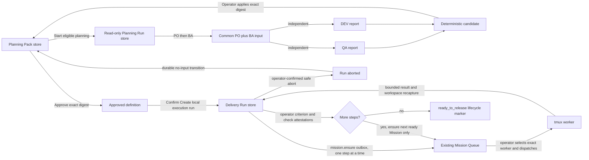

# Architecture

PaneFleet is a single Node.js process with a dependency-free browser client. It observes a host through bounded command adapters, owns local coordination state, and sends mutations only through named allowlisted operations.

## Components

| Component | Responsibility |
| --- | --- |
| `public/index.html` | Static terminal-first shell and accessible control surfaces |
| `public/app.js` | Browser rendering, interaction state, HTTP/SSE client, terminal windows, queue, Project Desk, and tools |
| `public/ui-state.js` | Small pure helpers for layouts, drawer state, attention filtering, launcher outcomes, and guarded snapshot patch application |
| `server.js` | HTTP authentication, static/API/SSE routing, host snapshots, exact-pane input, prompt queue, compatibility missions, notifications, Project Desk, services, and optional EC2 access |
| `delivery-plan.js` | Pure Planning Pack schema normalization, validation, canonical digest, readiness lint, lifecycle rules, and bounded task-envelope compilation |
| `delivery-plan-store.js` | Serialized, optimistic, idempotent, owner-only atomic Planning Pack repository |
| `delivery-planning-run.js` | Pure PO-to-BA-to-independent-QA/DEV planning state, bounded role envelopes, and deterministic candidate compilation |
| `delivery-planning-run-store.js` | Serialized, optimistic, idempotent, owner-only atomic Planning Run repository, separate from Plan and terminal state |
| `planning-role-report.js` | Strict schema and exact-rollout final-answer reader for planning-role reports |
| `planning-codex-resolver.js` | Install-time resolution and pinning of the exact official native Planning Codex executable, version, architecture, provenance, and SHA-256 |
| `delivery-run.js` | Pure digest-bound local Run, sequential task, evidence-summary, operator-verification, abort, and delivery-level state |
| `delivery-run-store.js` | Serialized, optimistic, idempotent, owner-only atomic Delivery Run repository, separate from Plan and Mission state |
| `workspace-baseline.js` | Strict v2 raw-byte Git/index and instruction baseline capture and comparison for local-run scope guards |
| `codex-telemetry.js` | Bounded live telemetry plus replayed, offset-checkpointed rollout-event and per-ticket usage accounting |
| `durable-json.js` | Exclusive owner-only temporary files, flush, and atomic replacement for durable JSON stores |
| `network-monitor.js` | Socket and SSH event parsing, bounded persistence validation, attribution, and security summaries |
| `runtime-config.js` | Shared finite integer defaults and bounds for timers, retention counts, and operational polling settings |
| `operator-access-token.js` | Generation, validation, and no-follow owner-only file loading for non-loopback operator credentials |
| `runtime-retention.js` | Pure retention decisions for agent history and audit archives |
| `prompt-schedule.js` | UTC cron validation and next-run calculation for recurring prompts |
| `sensitive-text.js` | Shared credential redaction and redaction-count accounting for logs, API responses, and persisted summaries |
| `host-metrics.js` | Linux available-memory, swap, and root-filesystem metric normalization for host health |
| `observation-cache.js` | Bounded in-memory TTL and in-flight sharing for non-authoritative display observations |
| `snapshot-events.js` | Pure full-versus-patch snapshot sequencing and size-safe event selection |
| `process-runner.js` | Central `execFile` adapter, timeouts, output bounds, and permanently forbidden tmux server destruction |
| `services.json` | Ignored machine-local authority for known services, links, logs, lifecycle commands, and workflow actions |
| `host-config.json` | Ignored machine-local workspace roots, entries, groups, aliases, and artifact-folder names |
| `data/` | Private owner-only Planning Pack, Planning Run, Delivery Run, prompt and idea queue, compatibility mission, notification, interaction, sampling, review, audit, network-rule, and optional access-token state |
| user systemd | Supervises PaneFleet outside the workload tmux failure domain |
| workload tmux server | Source of truth for live sessions, panes, processes, and terminal output |
| named review tmux socket | Isolated lifecycle for the optional ephemeral read-only review agent |

Node built-ins serve HTTP, persist files, hash identities, and invoke fixed executables. The only runtime npm dependency is `bcryptjs` for device sign-in password verification; the browser uses native DOM, fetch, EventSource, and storage APIs.

## Access and request flow

```mermaid
sequenceDiagram
    participant O as Operator browser
    participant H as HTTP boundary
    participant A as API handler
    participant D as Domain operation
    participant T as tmux or host adapter

    alt loopback listener
        O->>H: GET /
    else non-loopback listener
        O->>H: GET / with Basic host-control token
    end
    H-->>O: app plus HttpOnly SameSite control cookie
    O->>A: /api request plus current cookie
    A->>A: validate cookie; JSON and origin for POST
    A->>D: named read or mutation
    D->>T: bounded fixed command or exact-pane keys
    T-->>D: capped result
    D-->>O: redacted JSON or SSE update
```

The minimal `/healthz` route is available without operator authentication or the control cookie for local supervision. Every operational `/api` route requires the same-page control cookie. By default, a non-loopback listener applies the Basic challenge before serving static content or allowing the page to obtain that cookie. A private HTTPS loopback-proxy deployment may instead use `device-session`: the normal form login verifies an owner-only bcrypt credential, stores only hashes of random per-device sessions, and issues a Secure, HttpOnly, SameSite=Lax 30-day cookie. Lax allows the remembered identity on safe top-level entries from another app while withholding it from cross-site POSTs. Its origin check normalizes the trusted public scheme and default port. An opaque `null` origin is accepted only for the login form when browser fetch metadata independently marks the request `same-origin`; the exception never reaches operational APIs. The per-process control cookie remains SameSite=Strict and a separate requirement. An explicit `trusted-network` deployment may delegate the first gate to independently verified exact-source ingress; the API cookie boundary remains unchanged.

## Observation data flow

Snapshot collection reads several sources concurrently:

1. tmux supplies pane identity, current command, working directory, and bounded recent output;
2. `ps` supplies process relationships and resource summaries;
3. `ss` supplies listening sockets and established SSH peer context;
4. `services.json` supplies reviewed labels, links, log paths, and allowed actions;
5. Git supplies bounded branch and HEAD identity for a focused allowed workspace; Project Desk does not collect working-tree status; and
6. local Planning Pack, Delivery Run, prompt queue, compatibility mission, interaction, notification, review, and access-rule stores supply durable coordination state.

The server normalizes and redacts that data, derives agent/service/attention summaries, then returns a snapshot or emits it through server-sent events. Terminal output and project text are treated as untrusted data, never as authority to run an action.

SSE delivery is a shared fan-out rather than one collector loop per browser. A new client receives one complete `snapshot` event. Later cycles compare top-level domains with the preceding stream state and broadcast one shared, sequenced `snapshot-patch` containing only changed or removed domains; a patch is replaced by a complete snapshot whenever it would be larger. Each domain is serialized once and reused for comparison, the full payload, and the patch. Event IDs bind each patch to its exact base sequence, and a browser that cannot prove that boundary reconnects for a complete snapshot instead of merging uncertain state. Concurrent connections share in-flight collection, a newly connected client may reuse a completed full payload only within `SNAPSHOT_EVENT_CACHE_MS`, and the timer stops after the last client disconnects. The SSE collector observes queue state but does not process prompt delivery; the independent server-owned monitor remains responsible for that work even with no browser open. Bounded `SNAPSHOT_OBSERVATION_CACHE_MS` entries reuse only display telemetry, top-process lists, and SSH-peer summaries. REST snapshots and all mutations remain independent of the SSE cache, and mutation handlers still revalidate durable revisions, exact pane identity, and allowlisted authority.

Clients join fan-out only after their initial full snapshot or explicit collection error. A shared initial/broadcast sequence is sent at most once per connection. Large frames get a chance to drain, but a connection still under backpressure when the next update arrives is closed instead of retaining an unbounded queue of snapshots. Healthy clients continue independently; the stalled browser uses the existing reconnect/full-snapshot path. This affects observation transport only, never terminal input or prompt delivery.

## State ownership

| State | Owner | Persistence |
| --- | --- | --- |
| Live panes, commands, and terminal output | workload tmux server | tmux/process lifetime |
| Service and workflow authority | operator-reviewed `services.json` | ignored local file |
| Workspace read authority and display metadata | `host-config.json` plus environment roots | ignored local file and process environment |
| Queued prompts, recurring UTC schedules, bounded final-response snapshots, and delivery history | server prompt queue domain | atomic owner-only JSON |
| Planning Pack definitions, approvals, readiness summaries, and idempotent operation receipts | delivery plan domain | separate atomic owner-only JSON; full details loaded lazily |
| Read-only role sequence, exact worker attempts, bounded reports, candidate diff, cleanup state, and apply receipts | planning run domain | separate atomic owner-only JSON; bounded summaries in snapshots, full details loaded lazily |
| Digest-bound local runs, sequential task state, Mission-link outbox records, bounded evidence summaries, operator verification, and abort records | delivery run domain | separate atomic owner-only JSON; full details loaded with its Plan |
| Compatibility missions and transition history | server mission domain | atomic owner-only JSON |
| Notifications and snooze state | server notification domain | atomic owner-only JSON |
| Agent interactions and samples | server collectors | private JSON |
| Audit events | server | private append-only JSONL with rotation |
| Non-loopback Basic token | operator environment or server token file | process environment or owner-only `data/access-token` |
| HTTPS operator credential | device-auth domain | owner-only `data/device-auth.json`; bcrypt hash only |
| Remembered HTTPS devices | device-auth domain | owner-only atomic `data/device-sessions.json`; random token hashes and expiry only |
| Control-session token | server process | memory; rotated on restart |
| Per-pane input serialization and supervisor samples | server process | memory |
| Window placement, pins, drafts, notes, snippets, and send history | browser | browser-local storage |

The browser is not authoritative for pane identity, prompt queue revision, dispatch reservations, filesystem roots, or allowed commands. It submits expected values that the server compares with current host state.

Planning Pack approval is similarly non-authoritative in the browser. The server recomputes the canonical definition digest, checks the current store and Plan revisions, and persists approval only for that exact definition. A Planning Run candidate is also non-authoritative until the operator applies its exact digest; apply creates a new unapproved Plan revision. Approval creates no Delivery Run or Mission and sends no terminal input. The recurring snapshot contains capped Plan and Run summaries and counts, never full role reports, raw prompts, transcripts, or operation journals.

## Planning and local-run flow

The current SDLC runtime keeps planning automation, approved intent, local execution, and terminal delivery under separate owners and gates:



The Planning Pack owns reviewed intent: classification, exact workspace, baseline identity, authority flags, PO/BA/DEV/QA artifacts, requirement traceability, approval revision, and canonical digest. Its role artifacts may be operator-authored or copied from one explicitly applied Planning Run candidate.

The Planning Run owns only pre-approval automation. It is bound to a current planning-phase, standard-depth, local-reversible `change` or `build` Plan whose sole enabled authority is `workspaceWrite`. PO and BA run sequentially; QA and DEV receive identical PO-plus-BA inputs and do not receive each other's first report. Installation pins one canonical native Codex 0.147.0 executable, version, and SHA-256; runtime content or identity drift fails closed with no launcher fallback. Runtime does not invoke `--version` or `mcp list`: the installer establishes the version/SHA pin, and the server hashes the configured file plus the running `/proc/<pid>/exe` image before role input.

This is a drift boundary, not protection from the host account itself. Planning trusts the operator and other same-UID processes; owner-only stores, private runtime directories, pathname checks, and process-image attestation cannot defeat a malicious same-UID binary race or replacement. A root-owned immutable binary or held-file-descriptor launch is future hardening.

Before tmux creation, each attempt durably claims a provisional spawn lease whose deterministic session, context, scope, and launch bindings are cross-bound to the Run, role, and attempt. Only an exact pane observed before the lease deadline may be adopted. Adoption then pins the exact pane, Codex executable and process, sanitized environment, dedicated home and neutral context, minimal permission profile, configuration digest, rollout root and byte offset, approval policy, model, and compiled input digest. A late, ambiguous, or replaced observation enters reconciliation and cannot receive prompt input. An unclosed provisional lease remains an unresolved worker and blocks the next role, candidate, apply, and cancel.

Exact absence closes a provisional lease with no external action. If the exact transient scope remains active but process/rollout identity was never established, an authoritative detail response may enable a separate destructive one-shot stop; the public request carries only operation and optimistic revisions plus a fixed confirmation, not any lease/session/scope identifier. The action is never Continue and is never replayed automatically after an uncertain result. systemd enforces the scope's 30-minute runtime limit, 30-second stop timeout, and control-group stop sequence. Unknown or ambiguous inventory stays blocked until authoritative observation is restored. The adopted role worker has no project workspace grant and no callable shell, code, browser, MCP, plugin, memory, subagent, or image surface. Reports are bounded structured data, not terminal authority; the internal worker never enters the public terminal inventory or capture APIs.

The Planning Run compiler may propose only `roles` and `unresolvedQuestions`. Applying its exact candidate digest is a separate optimistic, idempotent cross-store operation that creates a new unapproved Plan revision. It cannot approve a Plan, create a Delivery Run or Mission, write the project workspace, or authorize release/live work. Resource pressure, identity loss, invalid output, cleanup ambiguity, or uncertain input pauses durably with no automatic resend. A Continue operation is durably bound to one exact `resource_retry` or `cleanup_only` intent before a new spawn or cleanup input; replay never creates a second worker or retries uncertain text. Startup reconciles existing records without spawning a worker or typing, and a process-local continuation must be restored explicitly after restart.

The Delivery Run owns execution state without changing the approved definition. Run creation is limited to ready, current, local-reversible `change` or `build` plans whose only authority is `workspaceWrite`. It captures the current workspace baseline, binds the approved Plan revision and digest, derives ordered DEV tasks and linked acceptance IDs, and writes one `mission.ensure` intent. Only the first unverified task may have a Mission; later tasks remain held.

The baseline collector is intentionally separate from Project Desk. The supported execution shape is an isolated, conventional Git checkout whose canonical `.git` directory is inside the repository, owned by the current user, not group/world-writable, and accompanied by no ignored paths. Baseline v2 uses pinned, hardened Git identity/index queries and directly fingerprints every index-tracked and untracked file. It does not invoke working-tree porcelain, diffs, `hash-object`, repository hooks, or content filters. It rejects sparse state, linked-worktree or outside/untrusted Git metadata, gitlinks/submodules, unmerged entries, `assume-unchanged` and `skip-worktree`, repository-wide ignored paths, and unsafe hardlink, special-file, or symlink cases. Modified and untracked files remain representable as fingerprints and are compared against later task captures.

Mission Queue owns terminal delivery. A linked Mission contains the binding key and bounded envelope, but creating or reconciling that Mission only makes it ready. The operator must separately select and dispatch an exact worker in Mission Queue. A bound Run accepts only a worker whose foreground process command proves the Local Delivery profile (`workspace-write`, approval policy `never`, and outbound sandbox network disabled), contains none of the forbidden bypass/search/danger flags, has no contradictory authority telemetry, and is rooted at the exact Run workspace.

Dispatch binds the exact tmux session creation time, pane coordinate, intrinsic pane ID, and pane PID plus the Codex execution PID, rollout ID, rollout-source ID, and foreground-command digest. It records the rollout file size before input as `rolloutStartOffset`. Supervision then reads only complete rollout records after that offset and requires the exact dispatch marker, a later structured final answer, matching sandbox and approval authority, and no observed network-authority contradiction from the same rollout. When that rollout schema omits network authority, the pinned launch argument remains the network-denial proof; an observed value other than disabled still fails closed. Existing workspace conflict locks, durable pre-input claims, literal delivery, completion supervision, and uncertain-delivery behavior remain authoritative.

After a linked Mission returns for verification, the Run handler recaptures the baseline and accepts only nonempty changes within the task's approved paths with unchanged repository identity, HEAD/branch, index and index flags, ignored-scope digest, approved-scope coverage, and applicable instructions. It persists bounded path and report summaries rather than full diffs, terminal captures, or command logs. The operator records an outcome, method, and observation for each linked acceptance criterion, an outcome and observation for each required DEV-step check, and an overall note. PaneFleet persists bounded operator evidence summaries but does not execute the checks or retain their output; `verified_locally` is therefore an operator-attested local state. A Plan's `ready_to_release` phase is only a lifecycle marker and supplies no release or external authority.

An explicit abort is available for an unverified Run only after every linked Mission is safely undispatched, ready, verifying, or terminal. It records an operator reason/evidence, terminalizes the Run, cancels ready or verifying Missions, and transitions the Plan back to `planning`; it never sends terminal input or a process signal. A running, input-waiting, dispatching, or uncertain worker blocks abort until separately recovered. Startup reconciliation may finish an interrupted abort-to-planning transition, again without dispatch or retry.

## Exact-pane green-light dispatch

Queued prompt dispatch crosses the most sensitive boundary in the system. Its sequence is intentionally conservative:

```mermaid
sequenceDiagram
    participant B as Browser
    participant Q as Prompt queue domain
    participant X as Exact-pane input queue
    participant T as Workload tmux

    B->>Q: Add prompt for one exact live terminal
    Q->>T: read current session and pane identity
    Q->>Q: persist queued item; perform no terminal input
    loop snapshots while line has a head item
        Q->>T: sample exact pane and visible Codex composer
        Q->>Q: require two stable green observations
    end
    Q->>Q: persist one dispatch claim before input
    Q->>X: enqueue literal marked prompt
    loop bounded chunks
        X->>T: revalidate intrinsic pane ID and PID
        X->>T: send literal text only
    end
    X->>T: sample complete paired markers
    X->>T: revalidate exact identity
    X->>T: send one Enter
    X->>T: sample stable post-marker acceptance
    alt accepted
        X-->>Q: Sent; wait for stable footer or safely bounded composer return
    else uncertain, replaced, or failed
        X-->>Q: Needs review; pause this line; never resend
    end
```

The exact identity includes session name and creation time, window/pane coordinate, intrinsic tmux pane ID, and pane PID. Before typing, the server enables per-pane `remain-on-exit` and revalidates that identity; failure sends no input. Dead panes remain inspectable, are classified as stopped, and cannot be green or promptable. Pane input is serialized so concurrent browser windows cannot merge keystrokes. An uncertain Enter is never retried automatically. Accepted delivery is not completion: the sent item remains the terminal-line head until the exact pane is stably ready with a Codex `Worked for` final boundary. This prevents intermediate green-looking tool states from completing a ticket or releasing its successor.

Recurring schedules sit strictly before this dispatch sequence. The server parses five-field cron expressions in UTC and, when due, appends an ordinary queue item. It never invokes a shell cron implementation. Each schedule retains its original exact pane identity, permits only one open generated item at a time, skips unavailable identities, and advances to the next future occurrence after downtime so missed intervals cannot create a catch-up burst. All generated items then follow the same durable claim, stable-green, literal-input, one-Enter, and no-retry path above.

Multi-agent prompts are bounded fan-out over these existing single-pane invariants. Queue fan-out validates every requested exact identity against one live snapshot and persists every resulting FIFO item in one atomic store replacement; a stale target aborts the whole queue operation. Immediate fan-out validates all identities first, then runs each target through the normal per-pane input serializer. Since submitted terminal input cannot be rolled back, the response records success or failure per target and PaneFleet never retries a partial or uncertain send.

Initial launcher prompts use the same paired-render and one-Enter philosophy. Direct reviewed terminal prompts also revalidate their exact target and remain separate from interrupt, stop, and forced-recovery controls.

For long marked queue input, leading and trailing witnesses may be confirmed at separate stable checkpoints. The leading marker is proven after the first bounded chunk, before viewport movement can hide it; the trailing marker is proven only after all chunks are typed. Exact-pane identity is revalidated throughout, and Enter remains forbidden unless both checkpoints succeed.

Idea generation is a normal queue producer, not a privileged implementation path. Owner mode creates an ordinary exact-pane FIFO item. Scout mode first validates the source identity and workspace, requires at least 35% host memory available and less than 90% root-disk use, caps concurrent idea scouts, and launches Codex with a read-only sandbox and approvals disabled. Draft mode is browser-local. Every dispatched mode uses bounded redacted completion summaries as untrusted quoted context, and the ordinary verified-result parser creates only proposed ideas.

## Agent Commons data plane

`agent-commons.js` owns the bounded schema, state machines, audience/scope filtering, independent-first inbox projection, request-bound idempotency receipts, and atomic owner-only JSON store. The browser reads the public projection in the ordinary snapshot and mutates it through same-origin operator routes. These routes call only the Commons repository; no Commons route depends on the terminal-input, service-control, ingress, or external-operation adapters.

An agent does not receive a browser credential. From a Codex tmux pane, `scripts/agent-commons.mjs` asks tmux for that pane's session creation time, intrinsic pane ID, pane PID, and current path, then atomically writes one bounded envelope to the owner-only inbox directory. During a successful tmux observation, the server reads envelopes without following symlinks, requires the claimed identity to match a currently live Codex pane, rejects future or secret-bearing requests, serializes repository application, and quarantines invalid envelopes. Commit-before-unlink is safe because the receipt digest makes an identical retry idempotent and a changed retry conflicting.

This local spool is intentionally a same-user coordination plane, not an authentication plane: another process under the operator UID could claim a live pane's public tmux metadata or read the underlying store. The selective inbox and independent-first projection shape normal agent behavior, while the hard safety property comes from keeping every message non-authoritative. Board, Ping, Nudge, and Stop request update only durable Commons data. The only urgent UI affordance opens the selected terminal for human inspection; it does not share code with terminal interruption.

Help routing is an enriched snapshot projection, not a Commons execution adapter. For each open root `help_request`, PaneFleet excludes the requester and sessions already occupied by a Mission or open prompt-queue item, then prefers an exact-workspace Codex agent whose observed status is idle, healthy, sendable, and queue-ready. A global request may recommend an existing idle agent but cannot create a helper until it has a valid project scope. Reviewing the recommendation only navigates to that terminal.

When no compatible existing agent is available, the projection may expose one deterministic helper identity only if the systemd-user control plane, recovery resource gate, and root-disk gate are healthy. **Prepare one helper** copies a locked draft into the existing New Agent launcher and starts nothing. The operator's ordinary same-origin create request is bound to the Commons ID; the server ignores the browser prompt in favor of a bounded quoted request, requires the exact existing workspace and deterministic name, rechecks the root revision immediately before creation, disables auto-recovery, and uses the normal workload-isolation and initial-input guards. The tmux session name makes concurrent approval attempts converge on at most one live helper. A helper-authored request cannot qualify another helper. Successful prompt acceptance is audited as transport only and does not resolve the request; the helper reports back in the thread and the outcome remains subject to review.

## Persistence and restart behavior

Planning Pack, Delivery Run, prompt queue, compatibility mission, Agent Commons, and notification changes are serialized in process and written through atomic replacement. Plan, Run, and Commons operations carry durable idempotency receipts; repeating the same operation and request returns its original result, while reusing an ID for different content fails closed. Queue, Mission, Plan, Run, Commons, and store revisions reject stale browser decisions.

Creating a Run and ensuring its Mission cross separate local stores. The Run's durable `mission.ensure` outbox makes that boundary recoverable: an uncertain or failed link becomes `reconcile_required`, and explicit or startup reconciliation inspects the binding and repairs only the durable link. Reconciliation never selects a worker, dispatches terminal input, or retries a prior terminal attempt. A verified task similarly makes the next step eligible for a just-in-time Mission rather than dispatching it. Aborting also crosses the Run, Mission, and Plan stores; a visible reconciliation result and startup pass may finish only the safe Mission cancellation or Plan-to-`planning` transition, never worker input or recovery.

Prompt Queue startup reconciliation independently turns any in-flight queued prompt into **Needs review** before snapshots can dispatch work, so restart never causes a resend. Audit history is append-only and rotated when bounded size is exceeded. Because Plan and Run records form one logical SDLC history while remaining separate files, operators must back up and restore both stores from the same stopped-process point.

An unsent item stopped specifically during literal confirmation has two revision-checked recovery transitions. **Wait again — no resend** revalidates the original exact pane and keeps the line blocked while the server passively watches the existing dispatch marker for a stable manually submitted turn; it never types or presses Enter. **Dismiss after review** revalidates the same identity, requires `sentAt` to remain empty, cancels the item without terminal input, and returns a linked refinement idea to its proposed state. Both transitions reject sent items, stale revisions, and replacement panes, and remain distinct from releasing a delivered item after completion review.

A delivered `completion_target_replaced` review has a separate one-time transition. It validates the revision and a live same-session replacement identity, archives the original as operator-released without semantic completion, creates a new FIFO item carrying the same text and any Idea linkage, and persists both changes atomically. This transition performs no terminal input; the normal dispatcher may act only after the new exact target later passes its stable-green gate.

The control-session cookie rotates whenever PaneFleet restarts. The persistent non-loopback Basic token does not rotate on a normal restart when it comes from the configured environment or existing owner-only token file.

The user systemd unit is not a workload tmux target. The restart helper snapshots the complete workload pane inventory, restarts only the unit, verifies stable local health and listener ownership, then compares the inventory. A mismatch is an operational failure rather than an accepted side effect.

The workload unit supervises the empty-capable default and managed-review tmux servers. Each persistent Codex command leaves its outer pane shell in that unit but runs Codex in a separate bounded transient scope. Passive live-process telemetry maps the pane to an exact rollout UUID and verifies that its session metadata is root-interactive before arming an owner-only recovery record. A nonzero scoped exit or missing workload session can therefore resume only that UUID sequentially without replaying prompt text; a normal exit, explicit Stop, identity conflict, uncertain input, legacy lineage, parented/sub-agent lineage, or failed verification disarms recovery. Planning-owned `codex-planning-*` workers are excluded from this generic registry and remain bound to their Planning Run's exact scope, result, cleanup, and reconciliation state.

## Current code shape

The current implementation concentrates much of the control plane in `server.js` and much of the browser behavior in `public/app.js`. That made cross-cutting safety invariants visible while the product was evolving, but both files are now modularization candidates.

A future refactor should preserve behavior while extracting clear seams:

- server adapters for tmux, processes, Git, files, EC2, and persistence;
- domain modules for the remaining exact-pane input, prompt queue, compatibility mission, notification, service, and access seams;
- small HTTP route modules that depend on those domains; and
- browser modules for terminals, Project Desk, queue, tools, access, and shared request/state utilities.

Modularization should proceed behind the existing integration tests. File size alone is not a reason to weaken the exact-identity checks, operation queues, persistence ordering, or fail-closed outcomes.
